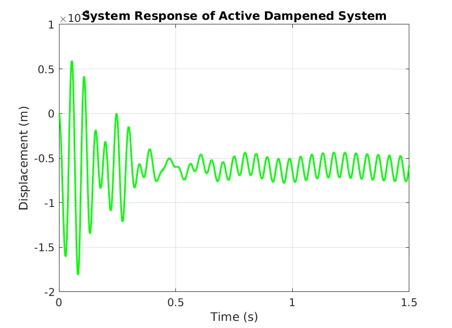

This project involved modeling a flexible I-beam in Simscape Multibody, simulating its undamped behavior, and then implementing both passive and active damping systems to compare their performance. The system was modeled using a combination of Simulink and Simscape blocks.

An oscillating force, tuned to match the first natural mode of the beam, was applied, and the response was observed. This exercise provided valuable insights into system dynamics and control. I was particularly pleased with the performance of the electromechanical spring-mass-damper system I designed, which demonstrated effective damping characteristics.

*Figure 1: Response of the I-beam with active damping applied.*

Overall, this project was an excellent opportunity to deepen my understanding of Simscape and control system design.
