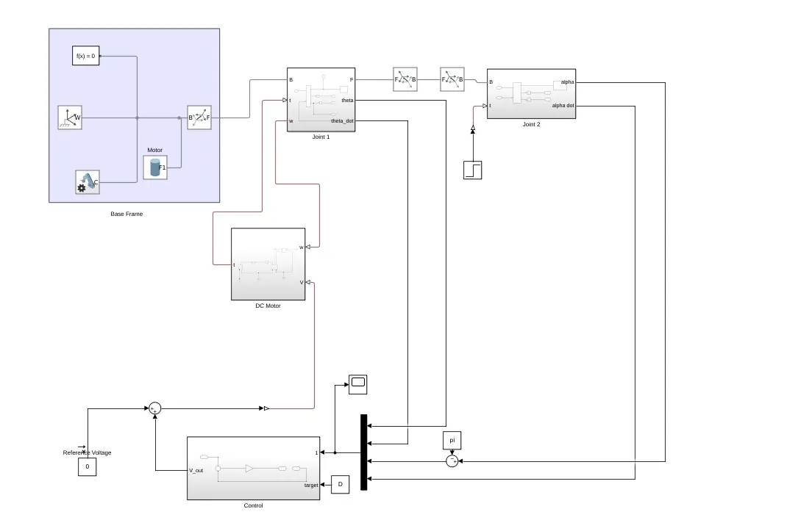
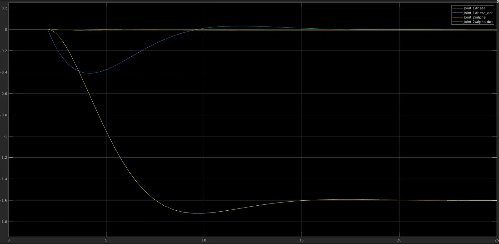

A Futura pendulum is an adaptation of the classic pendulum-on-a-cart problem. However, rather than having the revolute joint of the pendulum connected to a linear cart, the revolute joint is connected to a second revolute joint. This formulation allows for theoretically infinite angular rotation of the base joint, enabling unique motion possibilities.

The pendulum was modeled using Simscape Multibody, and a Linear Quadratic Regulator (LQR) controller was designed in Simulink to stabilize the pendulum in its upright position. MATLAB's linearization toolbox was used to linearize the system around its upright position, and the gain matrix was calculated from this linearization.

*Figure 1: Simulink model of the Futura pendulum system.*

Overall, the system proved to be quite stable, responding well to both initial displacement and further perturbations. This project was an excellent learning experience in modeling and controlling unstable systems using Simscape Multibody.

*Figure 2: System dynamics response of the Futura pendulum.*
